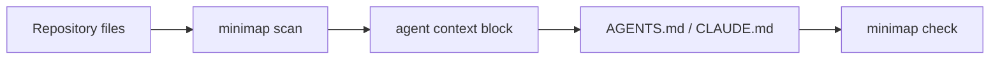

# Minimap

Deterministic repository context for coding agents.

[](https://github.com/forjd/minimap/actions/workflows/ci.yml)
[](https://www.npmjs.com/package/@forjd/minimap)
[](https://www.npmjs.com/package/@forjd/minimap)
[](LICENSE)
[](https://bun.sh)
[](#project-status)

Minimap scans a local repository, detects high-signal project facts, and writes a compact managed context block into files such as `AGENTS.md` and `CLAUDE.md`.

It is not a README generator. It is a deterministic context compiler for coding agents.

```bash
minimap scan
minimap generate
minimap write --target AGENTS.md
minimap check --target AGENTS.md
```

## Why Minimap?

Coding agents repeatedly rediscover the same repository basics:

- Which language, framework, and package manager is this?
- How should tests, linting, formatting, and type checks run?
- Is this Laravel, Vue, Inertia, Vite, Tailwind, Pest, PHPUnit, React, Next.js, or something else?
- Which commands are useful validation commands, and which commands should not be run without permission?
- What project conventions should an agent preserve before making changes?

Minimap turns those signals into durable, evidence-backed instructions.



## Example Output

Minimap writes only inside its managed block:

```md
<!-- minimap:start -->

<repo_context generated_by="minimap" schema_version="1">

  <summary>
    Laravel + Vue/Inertia + TypeScript project using Composer, Bun, Pest, Vite, and Tailwind CSS.
  </summary>

  <stack>
    <language name="PHP" confidence="high" evidence="composer.json present" />
    <framework name="Laravel" confidence="high" evidence="laravel/framework dependency detected" />
    <framework name="Vue" confidence="high" evidence="vue dependency detected" />
    <tool name="Vite" confidence="high" evidence="vite dependency detected" />
  </stack>

  <commands>
    <command name="php_tests" value="composer test" confidence="medium" category="test" />
    <command name="frontend_build" value="bun run build" confidence="medium" category="build" />
  </commands>
</repo_context>
<!-- minimap:end -->
```

## Installation

Minimap is Bun-native.

Run with Bun:

```bash
bunx @forjd/minimap scan
```

Or install globally:

```bash
bun install -g @forjd/minimap
minimap --help
```

Prefer shorthand?

```bash
bun i -g @forjd/minimap
```

You can also run it with npm:

```bash
npx @forjd/minimap --help
```

For local development:

```bash
git clone https://github.com/forjd/minimap.git
cd minimap
bun install
bun run src/cli.ts --help
```

## Commands

### Scan

Scan the current repository and print detected signals as JSON:

```bash
minimap scan
minimap scan --pretty
minimap scan --cwd ./some-project
```

`scan` is read-only. To preview generated context, use `generate` or `write --dry-run`.

### Generate

Generate a managed context block without writing it:

```bash
minimap generate
minimap generate --profile agents
minimap generate --profile claude
```

The `agents` and `claude` profiles currently produce the same output. The profile option exists so output can diverge later.

### Write

Create or update a managed block in a target file:

```bash
minimap write --target AGENTS.md
minimap write --target CLAUDE.md
```

Preview the resulting file without writing:

```bash
minimap write --target AGENTS.md --dry-run
```

### Check

Detect context drift:

```bash
minimap check --target AGENTS.md
```

`check` exits:

- `0` when the managed block matches the current repository scan.
- `1` when the file is missing, the managed block is missing, multiple blocks are present, or the generated block has drifted.

## Safe Writes

Minimap uses stable markers:

```md
<!-- minimap:start -->

...

<!-- minimap:end -->
```

Write behavior is conservative:

- If the target file does not exist, Minimap creates it.
- If the target exists without a managed block, Minimap appends the block.
- If the target contains one managed block, Minimap replaces only that block.
- If multiple managed blocks are found, Minimap refuses to write.
- Human-authored content outside the managed block is preserved.

## Safety Model

Minimap is local-only and deterministic.

It does not:

- call an LLM
- run project scripts during scan or generation
- evaluate JavaScript, TypeScript, PHP, or config files
- recursively summarize source files
- overwrite content outside the managed block
- send repository data to external services

It does:

- read targeted manifest and config files
- classify commands as validation, development, formatting, or risk signals
- mark destructive database, publishing, deployment, and volume deletion commands as risks
- include confidence and evidence for inferred facts

## Supported Signals

MVP detection covers:

- Node, JavaScript, and TypeScript via `package.json`
- Bun, pnpm, Yarn, and npm via lockfiles
- PHP and Composer via `composer.json`
- Laravel via `laravel/framework` or `artisan` plus `bootstrap/app.php`
- Vue, React, Next.js, Nuxt, Svelte, SvelteKit, Inertia, Vite, Tailwind CSS
- Vitest, Jest, Playwright, Cypress, Pest, PHPUnit
- ESLint, oxlint, Biome, Pint, PHPStan, Larastan
- shallow GitHub Actions workflow presence and names

## Good For

- Maintaining `AGENTS.md` or `CLAUDE.md`
- Giving coding agents a fast repository orientation
- Keeping context blocks current with `minimap check`
- CI drift checks for agent instructions
- Avoiding repeated manual repo summaries

## Project Status

Minimap is an MVP.

Current limitations:

- Bun is the supported runtime.
- Node-compatible bundling is not a goal yet.
- Monorepo support is shallow.
- Staleness checks compare the generated managed block exactly.
- The scanner intentionally avoids deep source parsing.

## Development

```bash
bun install
bun run format:check
bun run lint
bun run typecheck
bun test
```

Format changed files:

```bash
bun run format
```

The test suite uses fixture repositories and snapshots for generated output.

## Contributing

See [CONTRIBUTING.md](CONTRIBUTING.md).

## Releasing

See [RELEASING.md](RELEASING.md).

## Security

See [SECURITY.md](SECURITY.md).

## License

MIT, copyright Forjd.
